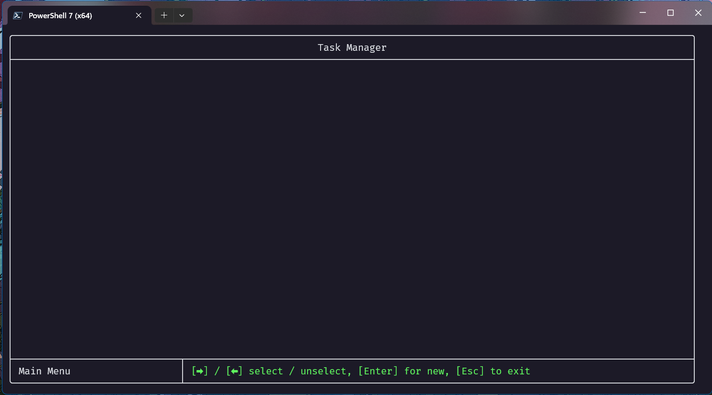
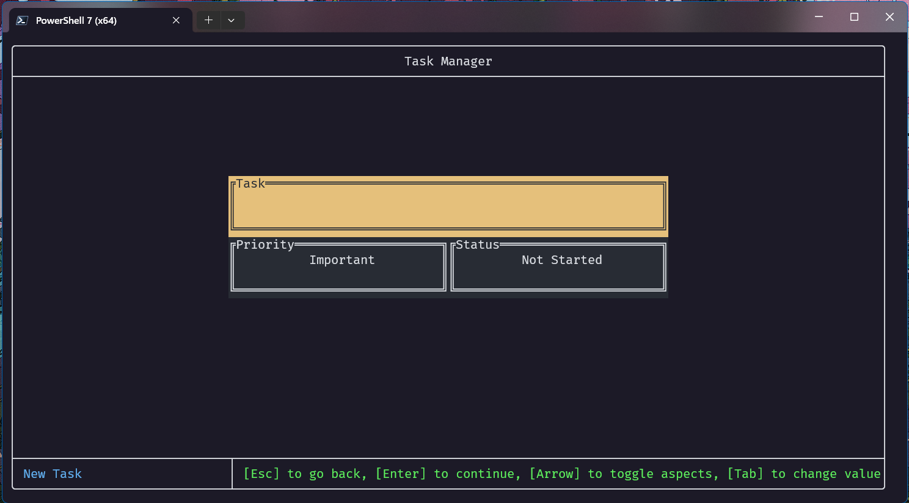
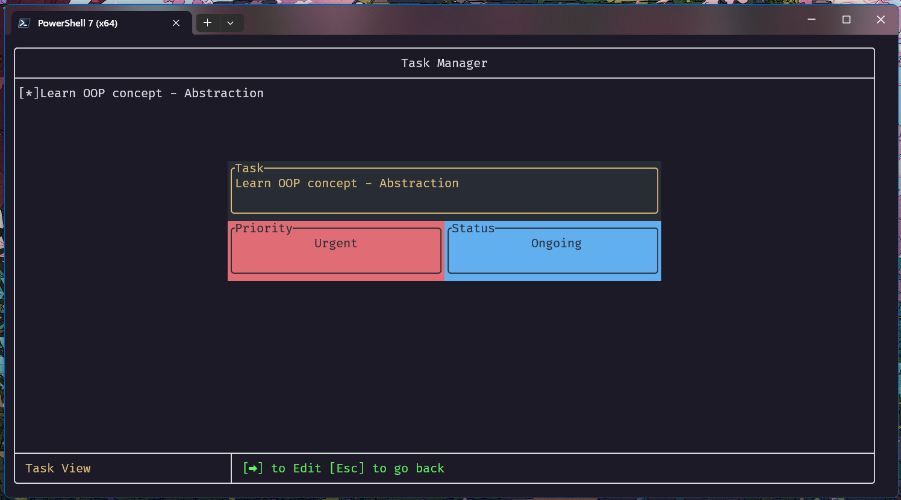
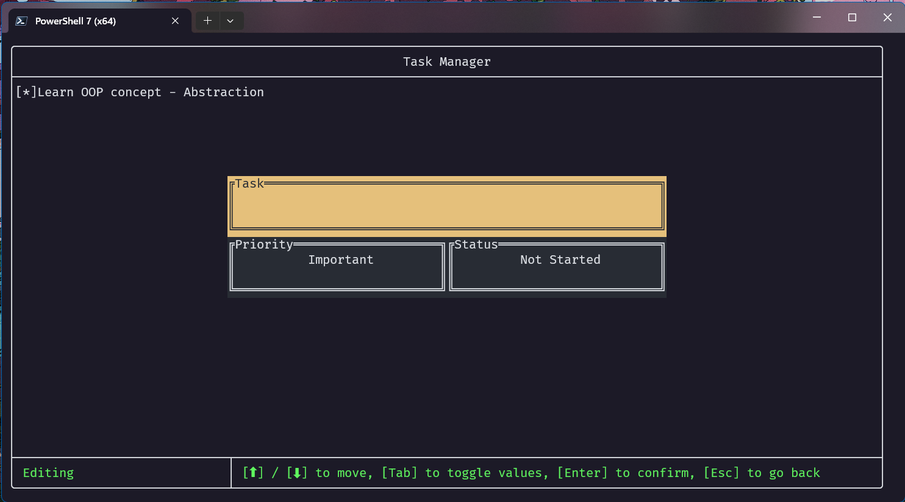
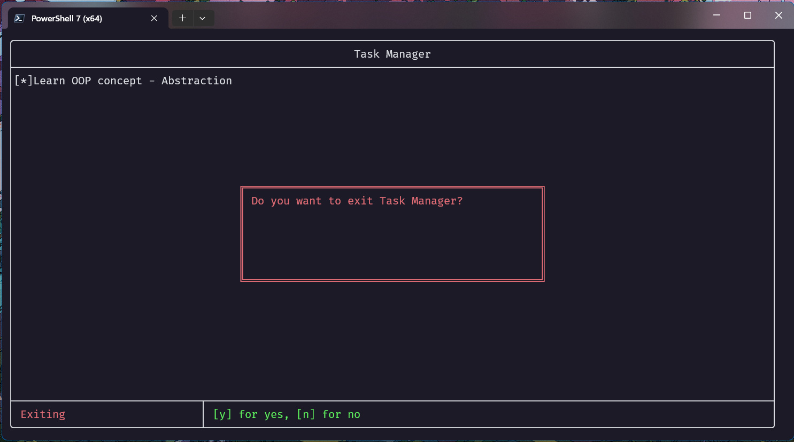

# Agora

## Description
Agora is a command line application built with Rust and features a Text-Based User Interface (TUI). It empowers users to efficiently manage their tasks in a fun and interactive way.

With Task Manager, you can stay organized and productive.

## Features
1. Task CRUD operations: Create, read, update, and delete tasks with ease. Each task includes a title, description, priority level, and due date.
2. Save the task locally: you can come back to your whenever, because it is saved in your computer.
3. Interactive TUI: Enjoy a visually appealing and user-friendly interface that makes task management a breeze.
4. Status Tracking: Keep track of the status of your tasks with the built-in status enum. Whether it's "NotStarted," "Ongoing," or "Completed," Task Manager has got you covered.
5. Faster than GUI: Since the app runs on terminal directly, it resources than a GUI.

## Demonstration

<video width="1080" controls><source src="docs/resources/final_demo.mp4" type="video/mp4"></video>

# About the process

## The process
The process of developing the project is a two-parter.  
In the first part, I developed a CLI Task Manager without a task-based user interface (see [Project Zeta](docs/ProjectZeta.md)).
This was done to understand the user requirements for the Agora TUI, such as:
* features of a task manager
* parameters of data structures
* necessary and unnecessary data structures
* user experience
* freedom of choice

Another reason was to understand the system requirements of the TUI, such as: 
* determining the main layout
* handling file I/O
* managing errors
* identifying the parameters required for data storage
* defining the necessary structs and enums
* establishing the application flow  

The development of the simple CLI was instrumental in determining the essential components of Agora, as well as those that were not necessary. Simultaneously, it laid the foundation for the entire project, including data structures, data flow, algorithms, and more.

The documentation for the CLI app are in the initial branch ([master/docs](https://github.com/abdulshaikh55/task_manager/tree/master/docs)).

The second part is the TUI. In this section, I built the User Interface Agora in the intial stages. As the 'blueprint' of what I wanted the task manager to do and not do, I could focus on the TUI and its backend. I had to read [examples](https://github.com/ratatui-org/ratatui/tree/main/examples) of codes and documentations on [ratatui.rs](https://ratatui.rs/) to implement the corresponding functionality. When I wanted to implement a feature I did not understand by reading the official documentation, I tried out code written by other programmers. This made me learn a lot about open source, software engineering and programming at a faster rate.

# Controls
We'll learn how to navigate through the app.

1. Main screen
    

    [`Enter`] => New Task Screen  
    [`Arrow Down` ] => Select next task  
    [`Arrow Up` ] => Select previous task  
    [`Arrow Left`] => Unselect task  
    [`Arrow Right`] => View task in detail  
    [`Delete`] => Delete selected task  
    [`Esc`] => Exit Screen  

2. New Task
    
    [`Enter`] => Save task and return to main screen  
    [`Esc`] => Return to main screen without saving  
    [`Arrow Up` | `Arrow Down`] => Toggle between task box and priority box  
    [`Arrow Right` | `Arrow Left`] => Toggle between priority box and status box   
    [`Tab`] => Toggle values (doesn't work in task block)

3. Task View
    
    [`Esc`] => Return to main screen  
    [`Arrow Right`] => Enter Editing mode  

4. Editng
    
    [`Enter`] => Save task and return to main screen  
    [`Esc`] => Return to main screen without updating  
    [`Arrow Up` | `Arrow Down`] => Toggle between task box and priority box  
    [`Arrow Right` | `Arrow Left`] => Toggle between priority box and status box   
    [`Tab`] => Toggle values (doesn't work in task block)

5. Exit
    
    [`y`] => Exit app
    [`n`] => Return to main screen

