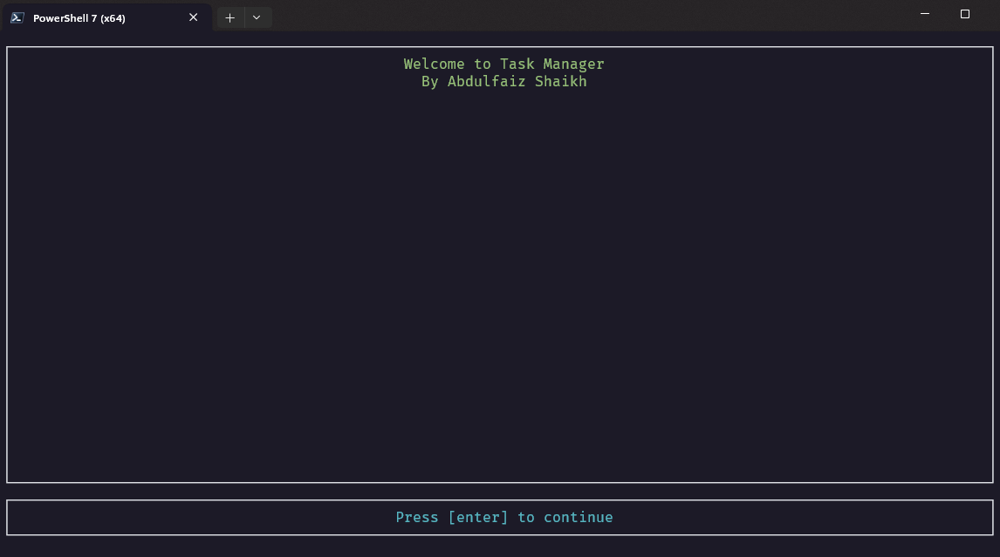
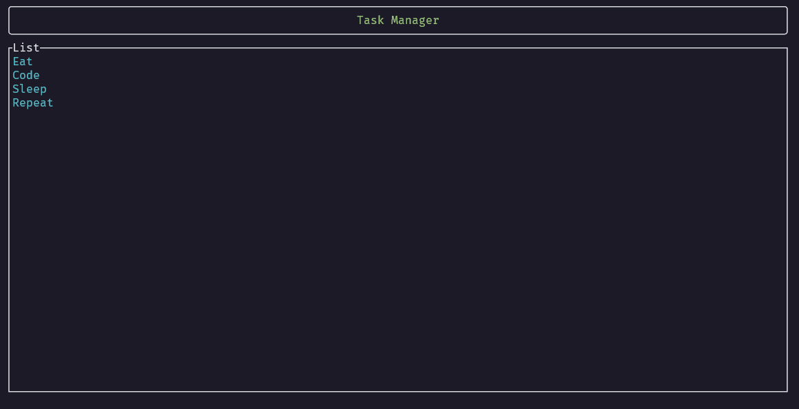
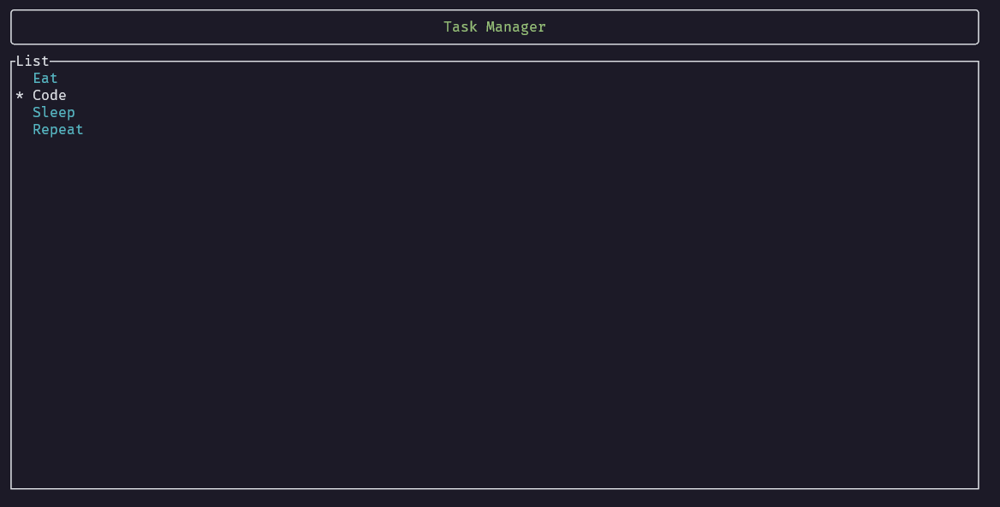

# Task Manager TUI

I have started learning and applying the Ratatui to turn our cli to tui. 
Ratatui applications are generally divided into modules that help us organize our application into different parts
The following will be the modules in our applications
1. main.rs
2. ui.rs
3. app.rs
4. tasks.rs 
5. task_manager.rs

## What functions have been added?
Introduction page:

Main screen:
  

Select tasks:

ui and app will be our frontend whereas tasks and task_manager will be our backend.

Our application will have four screens:
1. main screen: this screen will display all the tasks on the terminal
2. task screen: this screen will display information about the task we have chosen
3. edit screen: this screen will contain the editing tools of our tasks
4. exit screen: this screen will display message 'do you really want to exit?'

Mini features
1. If task is `NotStarted`, display it in blue.
2. If task is `Ongoing`, display it in yellow.
3. If task is `Complete`, display it in green.

Decision to be made whether to display a new screen altogether while changing tabs or have a pop-up screen.