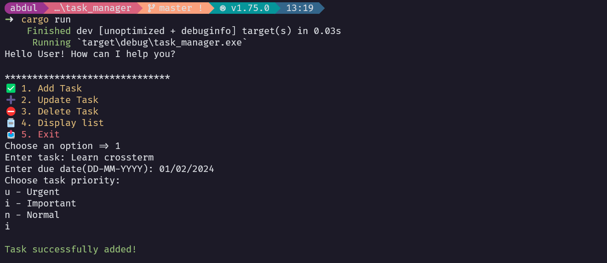
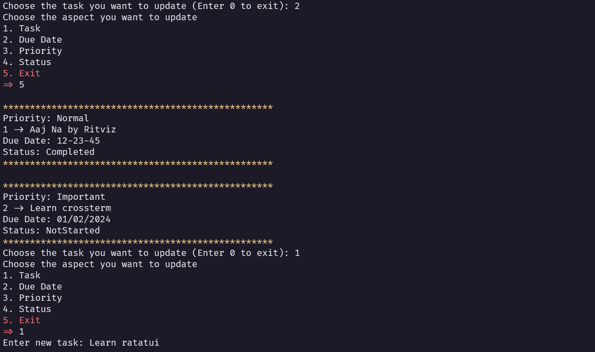
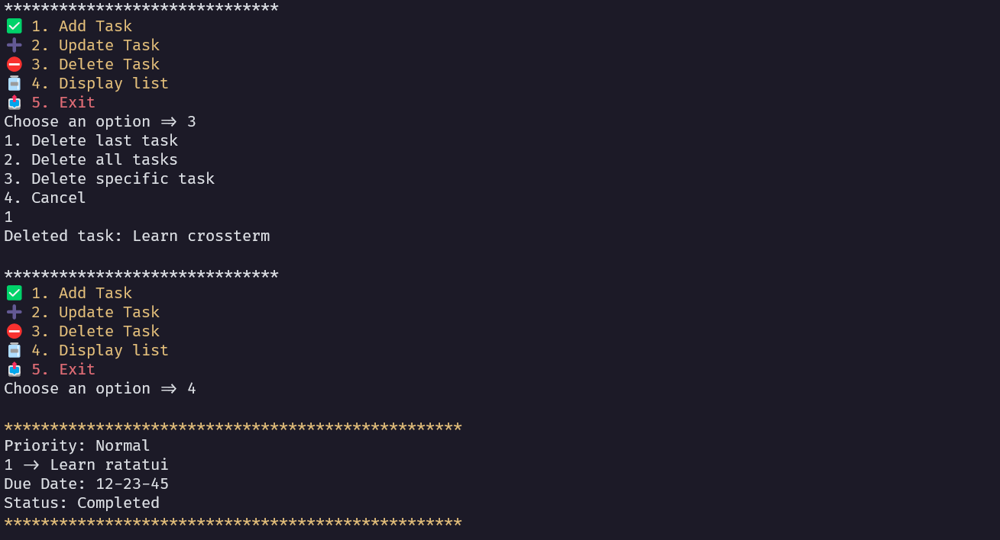
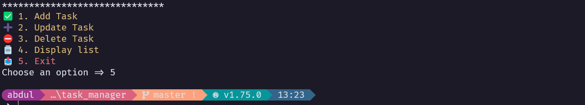

# The final Output
This is the last of the stages of the task manager app. This CLI app has all the functionalities of the task manager but our project is far from complete. I hope to remake this app as TUI using ratatui.
 
1. Add new task
   

2. Update existing task
   

3. Delete and Display task
   

4. Exit App
   
